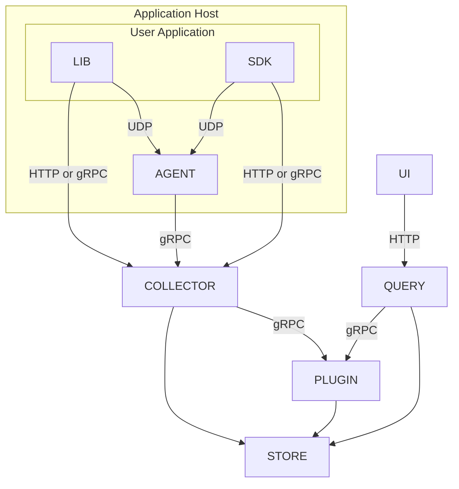

# rt-evm

**U**til **C**ollections of **EVM**.

A simple development framework for creating EVM-compatible chains.

```mermaid
graph TD
    LIB --> |HTTP or gRPC| COLLECTOR
    LIB --> |UDP| AGENT
    AGENT --> |gRPC| COLLECTOR
    SDK --> |UDP| AGENT
    SDK --> |HTTP or gRPC| COLLECTOR
    COLLECTOR --> STORE
    COLLECTOR --> |gRPC| PLUGIN
    PLUGIN --> STORE
    QUERY --> STORE
    QUERY --> |gRPC| PLUGIN
    UI --> |HTTP| QUERY
    subgraph Application Host
        subgraph User Application
            LIB
            SDK
        end
        AGENT
    end
```

### Gratitude

Thanks to all the people who already contributed!

